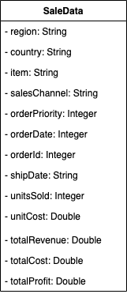

# Parse CSV Data Part 2

A common interview problem is taking raw CSV data , and modeling it into an object.

## CSV File Format

Usually the first line in a CSV file contains the table column labels. Each of the subsequent lines represent a row of the table. Commas separate each cell in the row, which is where the name comes from.

In this project you will parse the CSV data into a SaleData object and place them into an ArrayList.
